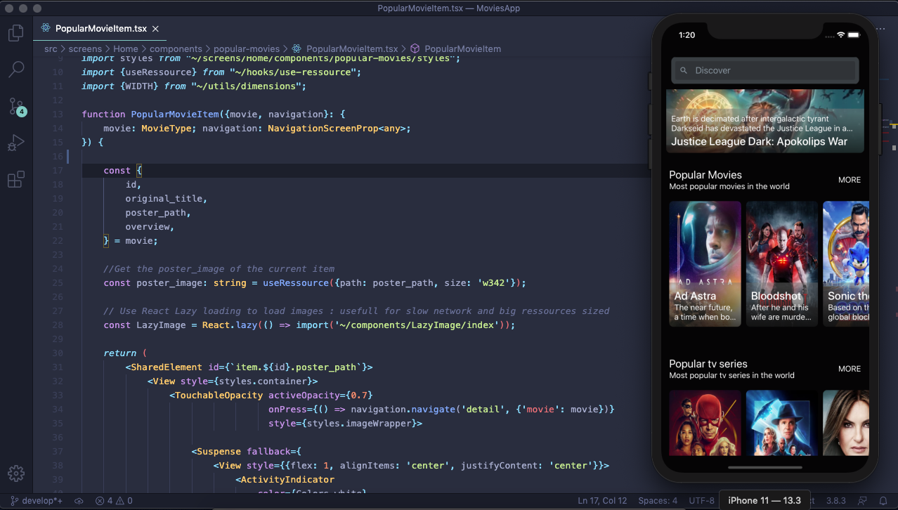
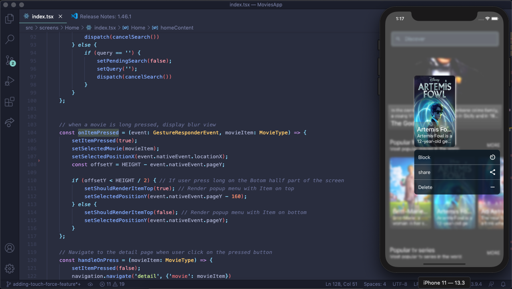
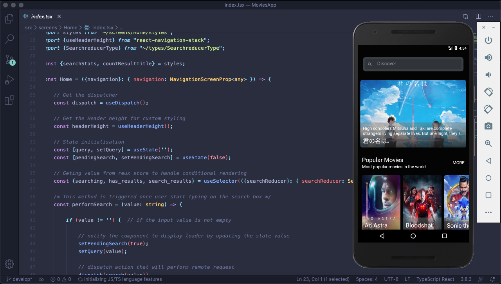
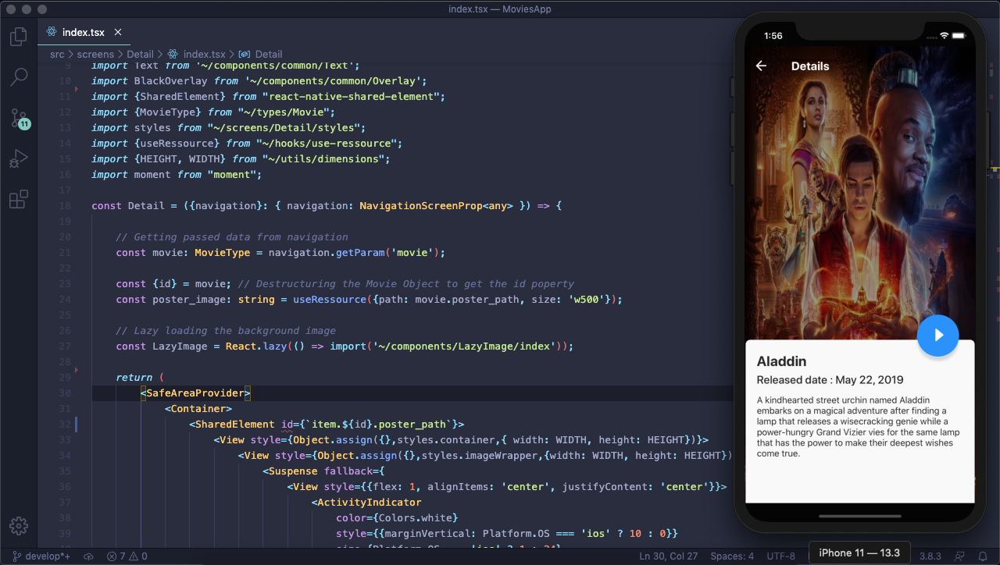
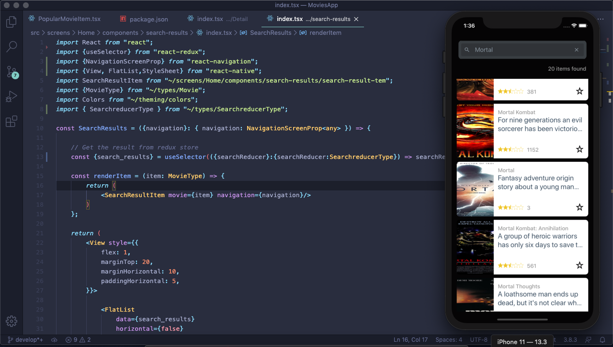

<p align="center">
    
</p>


# MetFlix 

>I have been asked to build a proptotype of a functionnal movies react-native application. I dicided to call it MetFlix
 This App is built on top of React Native with React.JS (Used React Hooks) and Typescript. 
 
 ## Results
- [x] Splashscreen
- [x] Home screen Movies List
- [x] Search feature
- [x] Movie Details
- [x] Movie Player
- [x] Documentation
- [x] Working on iPhone and Android Devices (Tested)
- [x] Responsive (Iphones and Tablets)
- [x] Responsive
- [ ] Test on Apple Tv OR Android TV ( IN PROGRESS )
- [ ] Unit Tests ( IN PROGRESS )

 ## Improvements (IN PROGRESS)
- [ ] Writing fully configurable and advanced video player with 
      better design than the default player (started) 
- [ ] Build for Web using React-native-web
- [ ] Light and Dark theme Switcher for Multi-theming support.


##  IOS Preview


##  IOS Preview


##  ANDROID Preview


##  Screen Detail


##  Screen Search



### Dependencies

 - React Js (Used with React Hooks) + Typescript
 - React Native
 - React Navigation
 - React-native-video
 - Others (See package.json at the root folder)
 
 ## Get Started
 
 #### 1. Clone the Repo
 
 On the command prompt run the following commands
 ```sh
 $ git clone https://github.com/Doha26/MetFlix.git
 
 $ cd MetFlix
 
 $ yarn  OR npm install (if you are using npm )

 $ react-native link
 
 $ cd ios && pod install && cd.. (For iOS build)
 
 $ react-native run-ios  OR  react-native run-android
 
 ```
 
 ### Author

*	[Pavel Foujeu](mailto:foujeupavel@gmail.com)  
 
     [](https://twitter.com/Pavel_FFP)
   [](https://www.linkedin.com/in/pavel-foujeu-8a8992142/)
   [](https://github.com/Doha26)


 
 ### Done with React-native
 
 *	[Instagram Clone ](https://github.com/Doha26/Instagram-clone)
 *	[Facebook challenge ](https://github.com/Doha26/Facebook-React-native)

